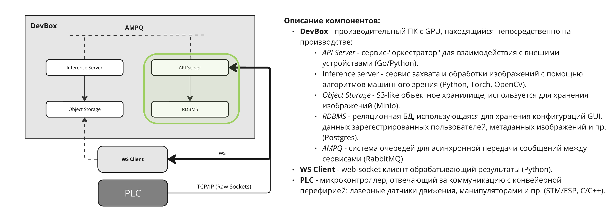

# synetra-be-challenge

## Задача
Написать два сервиса: ```api``` и ```camera``` (это часть `inference service`, по схеме, а для упрощения сервис камеры напрямую подключается к PLC). Использовать можно ```python``` или ```go``` на ваш выбор.  
HLD *реальной* системы:  



### Сценарий  

1. [PLC](./services/checker/app/tcp/server.py) отдает команду tcp клиенту о том, что некий объект на линии подъезжает к камере и пора делать фотографию.   

2. [Camera](./services/camera/Dockerfile) имитирует работу с реальной камерой: просто читает изображение из папки проекта, по триггеру tcp сервера (PLC). Затем создает сущность объекта в базе данных (при помощи запроса в api), сохраняет изображение в объектное хранилище, и отправляет данные в очередь. В примере - выход подается на очередь `inference.in` (для дальнейшей обработки изображения, которое в тестовом не покрывается), а также отправляет в [websocket-client](./services/checker/app/ws/client.py) (заменяет frontend) сообщение о "захваченом" кадре.  

3. [CRUD API](./services/api/Dockerfile) Скрывает работу с БД, и имеет публичные ресурсы создания, просмотра и изменений сущностей в БД. В нашем случае, чтобы не плодить таблицы - все "ручки" должны быть написаны для сущности одного обрабатываемого объекта (без пользователей, сессий и пр. не покрытых заданием вещей).  


### API  

Простой api, с 3 ручками:  
  * Добавление записи в бд  
  * Поиск записи по id  
  * Список всех записей  
 
База данных ```sqlite``` находится в ```./data/sqlite/excercise.db``` и содержит следующие 4 поля:  
  * ```id```  
  * ```image_url``` (ссылка на изображение, сохраненное в minio)  
  * ```width``` (ширина изображения в px)  
  * ```height``` (высота изображения в px)  

### Camera

Ключевой компонент системы.  
Сервис, имитирующий работу с камерой должен включать в себя:  
  * tcp клиент, который подключается к серверу (порт вы можете найти в ```.env```)  
  * websocket server для транслирования данных на клиент  
  * работу с rabbitmq, minio и api  

При получении от tcp сервера сообщения ```[s][save_image][e]``` вы должны:  
  * Взять изображение из ```./data/images/```  
  * Сохранить его в minio  
  * Сохранить данные об изображении в sqlite (ts, размеры, и тд.), через запрос к api  
  * Отправить сообщение, содержащее ссылку на изображение в minio, в формате json ws клиенту  
  * Отправить такое же сообщение в rabbitmq (`exchange` и `routing_key` - ```inference.in```)  

### Docker и docker-compose

Вся система, в тч бд и очереди, запускается через docker-compose. Подразумевается что имплементированные Вами сервисы тоже используют docker, и запускаются из того же docker-compose файла в корне проекта.  

## Требования  
  * Используйте на выбор ```python``` или ```go```  
  * Старайтесь использовать минимум сторонних библиотек  
  * Проект должен быть небольшим, но структурированным  
  * При взаимодействии с БД используйте SQL, без сложных ORM.  
  * Для удобства тестирования и демонстрации - имплементируйте простой web-клиент, где можно скачивать изображения и просматривать события полученные по ws.  
  
  `*` (опционально) Предложите улучшения существующей архитектуры  
  ** (опционально) Добавить интеграционные и e2e тесты для базовых сценариев взаимодействия сервисов  
  ** (опционально) Сопроводите ваше решение небольшой секцией в ```README.md```: ньюансы имплементации, особая инструкция по запуску и тестам и тд.  

## Запуск

```bash
$ docker compose up -d
```

### Остановка

```bash
$ docker compose down
```

## Решение

Роли `camera` - зеркальные, относительно `checker`: TCP-клиент и WS-сервер/

По триггеру `[s][save_image][e]` последовательно берётся следующее изображение из `data/images`, парсится ширина и высоту напрямую из PNG IHDR-чанка. Заливается файл в MinIO, получеая публичный URL. Создаётся запись в `api` (`POST /objects`), рассылается получившийся JSON параллельно в WS (`checker`) и в RabbitMQ.

### Переменные окружения

```
TCP_HOST=checker
TCP_PORT=4096
WS_HOST=camera
WS_PORT=1234
API_HOST=api
API_PORT=8000
SQLITE_PATH=/data/sqlite/excercise.db
MINIO_ROOT_USER=minioadmin
MINIO_ROOT_PASSWORD=minioadmin123
MINIO_ENDPOINT=minio:9000
MINIO_BUCKET=images
MINIO_PUBLIC_ENDPOINT=localhost:9000
IMAGES_DIR=/data/images
RABBITMQ_DEFAULT_USER=guest
RABBITMQ_DEFAULT_PASS=guest123
RABBITMQ_HOST=rabbitmq
```

### Запуск

Добавить в директорию data/images фотографии для работы `camera`

```bash
$ docker compose up -d
```

### Остановка

```bash
$ docker compose down
```

### Веб-клиент

`web-client/index.html`

Обращение происходит на прямую к api и WS-серверу

### Возможные улучшения архитектуры

- health-check у `minio`/`rabbitmq` вместо retry-логики подключения на стороне клиентов
- Синхронная обработка кадра в TCP-потоке — при затяжном сбое MinIO/API/RabbitMQ блокирует приём следующих триггеров. Нужна внутренняя очередь и отдельный воркер для обработки
- Presigned URL с TTL вместо статичного публичного адреса для `image_url`

### Тесты

**Unit**
- разбор PNG-заголовка (`image_meta.py`)
- разбор триггера из TCP-потока

**Integration**
- проверка пордяка вызовов и корректности подготовленных данных

**E2e**
- поднимается вся система, ожидается, пока `checker` дошлёт первый триггер и `camera` обработает кадр, проверяет результат в трёх точках: новая запись в `api`, скачивание файла из `image_url`, появление сообщения в очереди RabbitMQ.

```bash
make tests  # unit + integration
make tests-e2e  # e2e
```